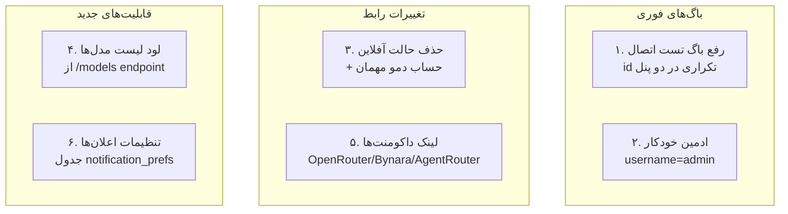
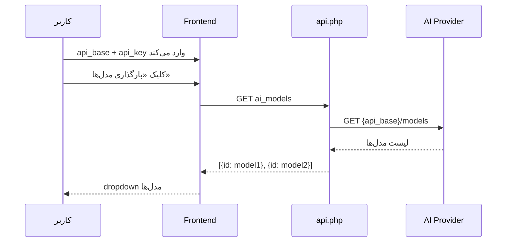

# برنامه معماری — فاز ۳

## مرور کلی
۶ قابلیت جدید/رفع باگ برای اپلیکیشن مالی شخصی PWA.



---

## ۱. رفع باگ تست اتصال (id تکراری)

**مشکل**: دو دکمه با `id="userTestAIBtn"` و دو div با `id="userAITestResult"` وجود دارد — یکی در تب بینش‌ها و یکی در تب تنظیمات. `getElementById` فقط اولین مورد را برمی‌گرداند.

**راه‌حل**:
- دکمه در تب بینش‌ها: `id="insightsTestAIBtn"` + `id="insightsAITestResult"`
- دکمه در تب تنظیمات: `id="settingsTestAIBtn"` + `id="settingsAITestResult"`
- تابع `testAIConnection(btnId, resultId)` پارامتر بگیرد

**فایل‌های تغییر**: `index.html`

---

## ۲. ادمین خودکار برای username=admin

**مشکل**: فعلاً فقط اولین کاربر ثبت‌نام‌شده ادمین می‌شود. کاربری با نام `admin` که بعداً ثبت‌نام کند ادمین نمی‌شود.

**راه‌حل**: در `createUser()` در `db.php`:
```php
$isAdmin = ($userCount === 0 || strtolower($username) === 'admin') ? 1 : 0;
```

همچنین در `handleLogin()` در `api.php`: اگر کاربر با نام `admin` وارد شد و `is_admin=0` است، خودکار `is_admin=1` شود (برای دیتابیس‌های موجود).

**فایل‌های تغییر**: `db.php`, `api.php`

---

## ۳. حذف حالت آفلاین + حساب دمو مهمان

**مشکل**: دکمه «ادامه بدون ورود (آفلاین)» داده‌های واقعی localStorage را نمایش می‌دهد که برای دمو مناسب نیست.

**راه‌حل**:
- حذف دکمه `continueOffline()` و تابع آن
- افزودن دکمه «مشاهده دمو» که:
  - یک حساب مهمان با داده‌های نمونه (۳-۴ تراکنش، ۱ بودجه، ۱ هدف) در حافظه موقت (session) ایجاد می‌کند
  - داده‌های نمونه در یک آبجکت JS تعریف می‌شود (نه از دیتابیس واقعی)
  - کاربر مهمان نمی‌تواند ذخیره کند (دکمه‌های ذخیره غیرفعال یا پیام «برای ذخیره وارد شوید»)
  - بنر بالای صفحه: «حالت دمو — برای ذخیره داده‌ها وارد شوید»

**فایل‌های تغییر**: `index.html`

---

## ۴. لود لیست مدل‌ها از API

**مشکل**: کاربر باید نام مدل را دستی تایپ کند.

**راه‌حل**:
- endpoint جدید `ai_models` در `api.php`: با استفاده از تنظیمات AI کاربر، `GET {api_base}/models` را صدا می‌زند و لیست مدل‌ها را برمی‌گرداند
- در فرانت‌اند: دکمه «بارگذاری مدل‌ها» که بعد از وارد کردن api_base و api_key، لیست را لود کرده و در یک `<select>` نمایش می‌دهد
- اگر خطا داد (مثلاً API از /models پشتیبانی نمی‌کند)، فیلد متنی باقی بماند



**فایل‌های تغییر**: `api.php`, `index.html`

---

## ۵. لینک داکومنت‌ها

**راه‌حل**: در پنل تنظیمات AI، یک بخش «راهنمای دریافت کلید API» با لینک‌ها:
- OpenRouter: `https://openrouter.ai/` — رایگان، ده‌ها مدل
- Bynara: `https://router.bynara.id/` — سرویس ایرانی
- AgentRouter: `https://agentrouter.org/` — سرویس بین‌المللی
- OpenAI: `https://platform.openai.com/` — رسمی

**فایل‌های تغییر**: `index.html`

---

## ۶. تنظیمات اعلان‌ها

**مشکل**: کاربر و ادمین نمی‌توانند انتخاب کنند چه اعلان‌هایی دریافت کنند.

**راه‌حل**:

### جدول جدید در db.php:
```sql
CREATE TABLE notification_prefs (
    user_id INTEGER PRIMARY KEY,
    budget_warning INTEGER DEFAULT 1,      -- هشدار بودجه ۸۰٪/۱۰۰٪
    recurring_reminder INTEGER DEFAULT 1,   -- یادآوری اقساط ثابت
    goal_progress INTEGER DEFAULT 1,       -- نزدیک شدن به هدف
    -- ادمین:
    new_user_notify INTEGER DEFAULT 1,     -- کاربر جدید ثبت‌نام کرده
    user_deactivated INTEGER DEFAULT 1,    -- کاربر غیرفعال شده
    system_error INTEGER DEFAULT 1,        -- خطای سیستم
    backup_reminder INTEGER DEFAULT 1,     -- یادآوری پشتیبان‌گیری
    FOREIGN KEY (user_id) REFERENCES users(id) ON DELETE CASCADE
);
```

### API endpoints:
- `GET notification_prefs` — دریافت تنظیمات کاربر
- `POST notification_prefs` — ذخیره تنظیمات

### UI:
- در `index.html`: یک مودال «تنظیمات اعلان‌ها» با چک‌باکس‌ها
- کاربر عادی: ۳ چک‌باکس (بودجه، اقساط، اهداف)
- ادمین: ۴ چک‌باکس اضافه (کاربر جدید، غیرفعال‌سازی، خطا، پشتیبان)
- تابع `checkSmartNotifications()` قبل از نمایش هر اعلان، تنظیمات را بررسی کند

**فایل‌های تغییر**: `db.php`, `api.php`, `index.html`, `admin.php`

---

## ترتیب اجرا

1. **باگ تست اتصال** (index.html) — سریع
2. **ادمین خودکار** (db.php + api.php) — سریع
3. **حذف آفلاین + دمو** (index.html) — متوسط
4. **لیست مدل‌ها** (api.php + index.html) — متوسط
5. **لینک داکومنت‌ها** (index.html) — سریع
6. **تنظیمات اعلان‌ها** (db.php + api.php + index.html + admin.php) — پیچیده
7. **bump sw.js** + تست نهایی
